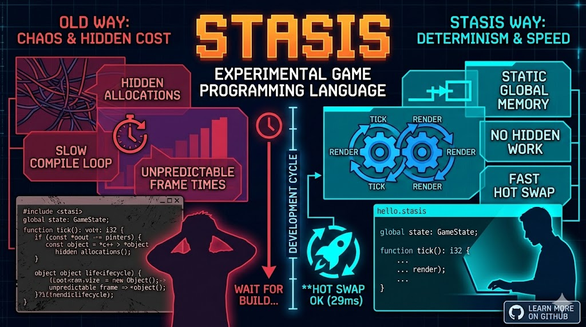

# Stasis



Stasis is an experimental programming language for games and simulations that should remain understandable while they run and while they change.

The repository includes a Visual Studio Code extension under `vscode-stasis/` backed by a standard
reusable LSP server, with diagnostics, compiler-aware completion/hover/navigation/refactoring,
semantic highlighting, inlay hints, call and struct-composition hierarchies, Test Explorer
integration, graphical play-session controls, and typed live values. The live TUI consumes the same
in-process language-service operations.
Projects created with `stasis new` recommend it and enable Stasis-only format-on-save. See
[`vscode-stasis/README.md`](vscode-stasis/README.md).

It is built around a simple bargain: give up hidden allocation and invisible runtime work in exchange for explicit state, predictable layouts, deterministic ticks, and fast live iteration.

The compatibility boundary is documented in [`docs/runtime_compatibility.md`](docs/runtime_compatibility.md). Source-language, standard-library, and compiler APIs are developer-facing; generated command buffers and runtime artifacts are rebuilt together against the single current downstream ABI.

## Why Stasis Exists

Game code is easiest to reason about when the important facts are visible:

- Where does the state live?
- What changes it?
- In what order do changes happen?
- How much work can happen in one tick?
- What happens to live state when the code changes?

Stasis makes those questions part of the language and runtime model instead of leaving them to convention.

### State is a model, not plumbing

Persistent program data lives in static global memory. A game will usually collect that data in one global state struct. There is no garbage collector and no hidden heap allocation on the simulation path.

That constraint is intentional. The state declaration becomes a readable model of the world, a stable inspection surface, and the boundary used to decide whether a live code swap is safe.

### Time advances in ticks

`main()` initializes the program. The host then calls `tick()` and `render()` in a deterministic loop. Gameplay progression should be tick-based: identical initial state and identical inputs should produce identical results.

This makes replays, tests, debugging, and lockstep-style simulation natural consequences of the model rather than features bolted on afterward.

### Cost should be visible

Stasis favors fixed-size arrays, explicit loops, static layouts, and bounded work. Source code uses convenient struct-array syntax while the compiler can lower fields into predictable structure-of-arrays storage.

The goal is not merely speed. It is being able to explain where time and memory go.

### Live editing is a transaction

Development uses an in-process Cranelift JIT. Changed code is compiled in the background, checked for signature and layout compatibility, and committed between ticks. A swap either succeeds as a whole or the running program keeps its previous code and data.

`on_code_swap()` is the explicit place to restore invariants after a successful change. A failing hook aborts the swap; partial commits are never exposed to gameplay.

The strongest influences are the deterministic simulation mindset of **Age of Empires II** and the simple, debuggable, data-oriented approach of **Handmade Hero**.

## The Shape of a Stasis Program

Here is a complete moving-line game:

```stasis
import "../src/stdlib/stdlib.stasis";
import "../src/stdlib/graphics.stasis";
import "../src/stdlib/sdl_scancodes.stasis";

struct GameState {
    x: f32;
    speed: f32;
}

global state: GameState;
global host_frame: HostFrame;

function main(): i32 {
    init_window(800, 600, "Stasis Game");
    state.x = 120.0;
    state.speed = 3.0;
    return 0;
}

function tick(): i32 {
    host_frame.refresh();
    if (host_frame.quit_requested) { return 1; }

    if (host_frame.keys[Scancode.Left] != 0) {
        state.x -= state.speed;
    }
    if (host_frame.keys[Scancode.Right] != 0) {
        state.x += state.speed;
    }

    return 0;
}

function render(): i32 {
    begin_frame();
    clear(0.05, 0.05, 0.10, 1.0);
    draw_line(state.x, 60.0, state.x + 120.0, 60.0,
              1.0, 1.0, 1.0, 1.0);
    end_frame();
    return 0;
}

function on_code_swap(): void {
    // Repair state here if a compatible live edit changes an invariant.
    return;
}
```

The division of responsibility is deliberate:

- `global state` describes the persistent simulation.
- `main()` establishes its initial invariants and requests host resources.
- `tick()` refreshes one caller-owned `HostFrame`, reads that snapshot, and advances the model.
- `render()` turns the current model into drawing commands.
- `on_code_swap()` handles the exceptional transition between code versions.

Rendering does not own gameplay state, and elapsed wall-clock time should not decide simulation results.

## Using the Language

Stasis has familiar C-shaped expressions and control flow, but keeps its surface deliberately small.

### Values and state

```stasis
struct Enemy {
    health: i32;
    active: bool;
}

global enemies: Enemy[64];

function activate_enemy(index: i32, health: i32): void {
    enemies[index].health = health;
    enemies[index].active = true;
    return;
}
```

Primitive types include signed and unsigned integers, floating-point values, booleans, strings, and fixed-capacity UTF-8 values. Composite storage is made from structs, enums, and fixed-size arrays such as `Enemy[64]`.

Locals use `let`; types can be explicit or inferred when unambiguous:

```stasis
let lives: i32 = 3;
let next_lives = lives - 1;
```

Arithmetic, comparison, and assignment are infix:

```stasis
score += 100;
let alive = health > 0;
```

### Functions read naturally at the call site

A function whose first parameter is a struct can be called in receiver form:

```stasis
function damage(self: Enemy, amount: i32): void {
    self.health -= amount;
    return;
}

enemies[0].damage(5);
```

The equivalent `damage(enemies[0], 5)` form is also supported. Receiver form is preferred when it makes ownership obvious.

### Control flow stays explicit

```stasis
if (state.wave_complete) {
    start_next_wave();
} else {
    spawn_due_enemies();
}

for (let i = 0; i < 64; i += 1) {
    if (enemies[i].active) {
        enemies[i].tick_enemy();
    }
}

foreach (let enemy in enemies) {
    if (enemy.active) {
        enemy.damage(1);
    }
}
```

A `for` header always has all three clauses. Fixed extents and explicit traversal make loop cost easy to see.

### Tests are part of the language

Place tests in a `.test.stasis` file next to the code when practical:

```stasis
import "../src/stdlib/stdlib.stasis";

test `adds`(): bool {
    return 2 + 3 == 5;
}
```

Run them with:

```powershell
stasis test --dir tests/stasis
```

Tests use the same compiler and JIT path as programs, so they exercise language behavior rather than a separate test interpreter.

## The Everyday Workflow

Create a project and enter it:

```powershell
stasis new my_game
cd my_game
```

Every `stasis new` project includes GitHub Actions for a pull-request check and a Friday/manual
three-platform nightly compatibility run. The PR job checks the vendored snapshot and runs only
`stasis check`. Both workflows resolve the newest complete published Stasis nightly at CI runtime;
the PR job records its selection in the job summary. The `stasis.json` release ID continues to
describe the checked-in `vendor/stasis` snapshot and does not select the CI toolchain. The weekly
job updates the vendor snapshot,
checks formatting and compilation, runs tests, packages desktop builds, and retains temporary
workflow artifacts. It does not publish, tag, create releases, sign packages, or build mobile or
web targets. Project generation remains offline, including from development builds. Network access
occurs only when the generated workflows restore a GitHub release and verify its GitHub-published
SHA-256 digest and toolchain identity.

`stasis new` initializes Git and activates the generated formatting hook without pinning a
line-ending style. An attempted commit with noncanonical Stasis source formats the files
and stops; review and stage those changes, then retry the commit. Git must be installed and `stasis`
must remain available on `PATH` when committing. The generated `src/main.stasis` imports the
game-facing standard-library modules for core utilities, graphics, and single-pass UI layout so
those APIs are immediately discoverable.

The normal loop is:

```powershell
stasis fmt
stasis check
stasis test
stasis run
```

Generated projects track their checked-in `vendor/stasis` snapshot in `stasis.json`. When the
selected Stasis executable has different vendor content, or the checked-in tree differs from its
recorded hash, the next project command restores `vendor/stasis` and updates its manifest automatically.
A release-label change alone leaves an unchanged vendor snapshot and manifest untouched. Stasis owns that directory;
review and commit the resulting Git changes with the compiler upgrade.

For a graphical program, `stasis play path\to\main.stasis` keeps the process alive and watches the current import graph. From a project directory or any descendant, `stasis play` reads the entry and project name from the nearest ancestor `stasis.json`. Explicit entries still use that manifest root for project-root imports and asset preparation. Saving a `.stasis` file compiles a candidate in the background and attempts an all-or-nothing swap between ticks.

`play` can selectively profile named Stasis functions in the JIT hot path:

```powershell
stasis play game.stasis --ticks 600 `
  --profile-functions render,draw_board,draw_enemies `
  --profile-warmup 120 `
  --profile-output artifacts\render-profile.json
```

The report ranks functions by exclusive time and also includes calls, inclusive time, average
inclusive time, and maximum inclusive time. Only the named functions are instrumented, keeping the
measurement overhead bounded and making nested exclusive time meaningful. The warmup is reset after
the requested number of ticks so startup compilation and asset loading do not contaminate the sample.
Nested stacks remain thread-local, while completed counters are merged process-wide across threads.
The desktop CLI path applies to the JIT-backed `play` command; aggressively inlined functions may
need their caller selected instead.

Development mobile packages can profile the same named functions in AOT code:

```powershell
stasis package-mobile --target android-x86_64 --development-build `
  --profile-functions render,draw_board,draw_enemies `
  --profile-warmup-frames 600 `
  --profile-sample-frames 300
```

The mobile runtime writes one bounded `STASIS_PROFILE_START`, one `STASIS_PROFILE` row per selected
function, and `STASIS_PROFILE_DONE` to the platform log. Android reports are available through
logcat's `Stasis` tag. Mobile profiling is rejected for non-development packages so production
artifacts remain uninstrumented.

From a project containing `stasis.json`, `stasis tui` opens the manifest entry in the persistent live-workspace interface. Pass an entry path to override the manifest for one invocation.

Build distributable output with:

```powershell
stasis build --mode release
stasis package --target desktop
stasis package-mobile --target android-arm64
```

The integrated CLI, workspace manifest, JSON output, offline guarantees, and installation layout are specified in [docs/toolchain_cli.md](docs/toolchain_cli.md). Mobile packaging is documented in [docs/mobile_packaging.md](docs/mobile_packaging.md), and optional asynchronous host capabilities use the [platform service bridge](docs/platform_services.md).

## Visual Studio Code Extension

The repository includes the [Stasis extension for Visual Studio Code](vscode-stasis/README.md). Open
a folder containing `stasis.json`, then open any `.stasis` file; the extension activates one
persistent, workspace-scoped `stasis lsp --stdio` process and keeps its compiler index warm. Release
VSIX packages bundle a matching compiler, LSP, debug adapter, standard library, and graphics runtime,
so editor behavior does not depend on a different `stasis` executable on `PATH`.

The extension provides:

- continuous compiler diagnostics, canonical formatting, completion, hover, signature help,
  semantic highlighting, and inferred-type/parameter inlay hints;
- compiler-backed Go to Definition and references for functions, structs, locals, globals, and
  fields—including field navigation from expressions such as `state.player.health`—plus Outline,
  breadcrumbs, workspace symbols, rename, quick fixes, and import organization;
- call and struct-composition hierarchies, folding, nested selection ranges, linked editing, and
  bracket-aware snippets through standard LSP requests;
- Test Explorer discovery and isolated execution of `.test.stasis` files;
- Debug Adapter Protocol support for source breakpoints, pause/continue, step in/over/out, real JIT
  stack frames, lexical scopes, typed globals, and watch expressions;
- **Stasis: Start Play Session**, which launches the graphical game and supports transactional live
  function edits and compatible struct edits with automatic state migration, plus pause, single-tick,
  resume, and stop controls;
- a **Stasis > Live Values** view that starts with all globals in an expandable tree, supports typed
  inspection and watches, and can display arrays of structs as either a tree or table. Collections
  with an `active` or `Active` field hide inactive rows by default;
- tick-based live-value refresh (`stasis.live.refreshEveryTicks`, default `30`). Snapshots and watches
  are polled only while the Live Values view is visible, so a closed view adds no inspection polling
  to the running game.

Projects created by `stasis new` recommend the extension and enable format-on-save only for Stasis.
Install the platform VSIX from the [nightly releases](https://github.com/benwmaddox/StasisLang/releases),
or use `scripts/install_vscode_stasis.ps1` for a source-tree Windows development build. See the
[extension README](vscode-stasis/README.md) for configuration, debugging, packaging, and end-to-end
test commands.

## Data Belongs Beside the Model

Editable runtime data can live in a project-level `data/` directory. JSON and CSV files with matching `<name>.struct-meta.json` metadata bind to declared globals automatically.

Binding is schema-strict in both directions: unknown data properties, missing metadata paths, absent compiled globals, duplicate CSV keys, and capacity overflow are errors. A bad edit is rejected without partially changing the running state.

The workspace stasis test command discovers and applies the same data pairs before each test file, so tests observe the authored JSON values. Projects without a data/ directory keep their normal zero-initialized globals.

While `stasis play` runs, valid data edits are rebound between ticks. AOT packages stage the same data and compile its values into the runtime bridge, keeping development and shipped behavior aligned. See [docs/toolchain_cli.md](docs/toolchain_cli.md) for the complete binding contract.

## Deterministic Automation

`play` can use a bounded, versioned input script instead of physical pointer input:

```powershell
stasis play game.stasis --input-script input.json --ticks 120
```

It can also capture a chosen rendered frame:

```powershell
stasis play game.stasis `
  --input-script input.json `
  --screenshot artifacts\frame-12.png `
  --screenshot-frame 12 `
  --exit-after-screenshot
```

This turns a graphical interaction into a repeatable test artifact. PNG bytes are deterministic for identical pixels, though rasterization may still differ across graphics backends, drivers, and platforms.

Use PNG evidence for a representative still state. Use an MP4 recording when validation
depends on motion, timing, animation, input, state transitions, or a multi-step interaction. Review
the artifact itself after capture; the command succeeding does not prove that the rendered result is
correct. These formats are intentionally easy to hand to human and multimodal AI reviewers. AI work
summaries should include a `Visual evidence:` line with the inspected PNG/MP4 paths and what they
prove, use `not applicable` for non-visual work, or state clearly when relevant capture was not
available.

For deterministic desktop-first video review, use the hidden fixed-rate recorder:

```powershell
stasis --workspace samples/windows_launch_smoke record main.stasis `
  --output artifacts/frames --width 640 --height 360 --fps 60 --frames 3 `
  --input-script record_input.json
stasis --workspace samples/windows_launch_smoke record main.stasis `
  --output artifacts/review.mp4 --width 640 --height 360 --fps 60 --frames 3
```

An extensionless output is an atomically published, staged PNG sequence; `.mp4` uses
FFmpeg H.264/yuv420p plus AAC and requires `ffmpeg` on `PATH`. MP4 audio is the
existing game mixer rendered offline as deterministic 48 kHz stereo PCM16; no
physical device or microphone is used. Recording uses the normal JIT/render path,
zero tick sleep, fixed physical output dimensions, logical canvas letterboxing,
and no visible or focused window. PNG mode does not stage offline audio, although
guest code may still request its normal audio API. See
[docs/headless_recording.md](docs/headless_recording.md).

## Installation and Setup

Stasis is fast-moving and breaking changes are expected. Nightly release archives are published from `main` on the [GitHub Releases page](https://github.com/benwmaddox/StasisLang/releases).

Download the archive for your platform, extract it, and put the `stasis` executable on `PATH`. On Windows, SmartScreen may warn because binaries are currently unsigned. The archive includes the compiler, native build tools, runtime libraries, standard library, samples, mobile shells, agent workflow guide, and Stasis knowledge library needed for offline use.

To build the repository from source:

```bash
cargo build
cargo test
```

Windows graphical development also requires the native runtime:

```powershell
runtime\build.bat
cargo build -p stasis --release
```

Once the runtime exists under `runtime/build` or `runtime/build_ci`, the build stages `stasis_graphics.dll` beside `stasis.exe` automatically.

Run the primary sample from this repository with:

```powershell
cargo run -p stasis --release -- play `
  samples\brickout_revenge\brickout_revenge_v1.stasis
```

## Repository Map and Deeper Reading

- `docs/project_architecture.md` - recommended input, tick, state, and render
  structure for Stasis projects
- `docs/knowledge/README.md` — concise language, tool, data, and fixed-tick game patterns
- [`docs/deterministic_live_simulation_roadmap.md`](docs/deterministic_live_simulation_roadmap.md) — cross-cutting live simulation promise, boundaries, and capability gates
- `docs/spec.md` — canonical language semantics
- `docs/live-compilation-prd.md` — hot-swap product and architecture requirements
- `docs/toolchain_cli.md` — CLI and workspace contract
- `docs/mobile_packaging.md` — Android and iOS packaging
- [`docs/architecture_complexity_and_simplification.md`](docs/architecture_complexity_and_simplification.md) - directional complexity inventory and conservative consolidation sequence
- `apps/stasis` — integrated app and CLI
- `crates/stasis_compiler` — frontend, semantic checks, and Cranelift lowering
- `crates/stasis_jit` — JIT/AOT support and function-pointer indirection
- `crates/stasis_runner` — tick and swap sequencing
- `src/stdlib` — standard library
- `samples/brickout_revenge` — primary end-to-end sample

Stasis is not trying to hide the machine or the simulation. It is trying to make the relationship between them small enough to hold in your head.
