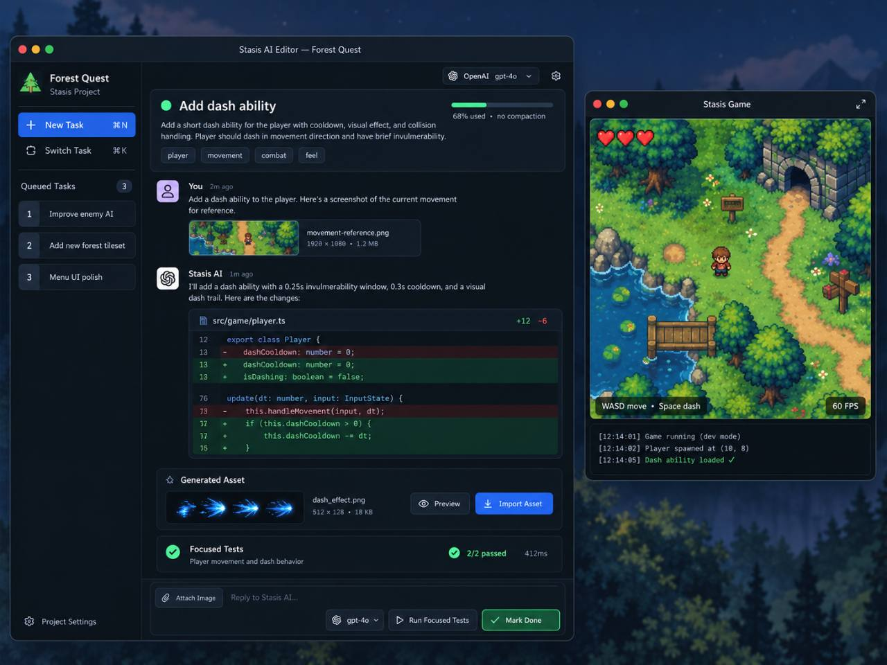

# AI editor task-flow UX direction

This user-supplied mockup is the product-direction reference for the desktop AI
editor. It is a non-runtime design artifact, not a screenshot of implemented
behavior and not a pixel-exact specification. Stasis source, terminology, and
platform chrome should replace illustrative details such as TypeScript paths.

The deliverable is a polished graphical desktop application. A terminal, TUI,
ANSI rendering, or terminal-like text grid does not satisfy this direction.
Use proportional interface typography, deliberate spacing, native pointer and
keyboard interactions, cards, thumbnails, stateful controls, and graphical
diff treatment comparable in clarity and finish to the reference.

## Product objective

Make a fast synchronous AI change to a running game easy to follow. A user
should be able to understand the request, supplied visual context, proposed
source changes, generated assets, validation, and live result without reading
transport logs or raw semantic-edit JSON.

The running game remains an independent native window so its renderer and input
focus are real. The editor should offer a remembered command that tiles the
editor on the left and the game on the right for development and recording.

## Required information hierarchy

- Keep task creation and task switching in a compact navigation rail.
- Render one chronological task timeline. User messages, attachments, AI
  replies, semantic actions, generated assets, host results, and focused tests
  appear in the order they occurred instead of in separate type-based groups.
- Put the objective and current execution state at the top. Keep provider,
  model, routing, token, cost, and timing details available without letting
  them dominate the task.
- Keep the reply composer and the next valid primary action visible at the
  bottom. Disable invalid actions with a concise reason.
- Use explicit state language: proposed, accepted, applying, applied, needs
  repair, testing, passed, failed, and done.

## Exact diff contract

Every semantic proposal must be previewed against the current project through
the same compiler-owned planning path used by Apply. The visible preview must
therefore be derived from `WorkshopSemanticEditPlan.changed_files`, including
the exact before/after source and hashes. Do not render a model-authored or
separately reconstructed approximation of the change.

Show a compact changed-file summary first. Each file expands to line-numbered
unified hunks with additions, deletions, and enough unchanged context to review
the edit. A repaired action exposes its revision history. If the current source
no longer matches the preview fingerprint, mark the preview stale and require a
fresh proposal or repair before Apply.

## Image and attachment contract

- Show captured game frames and imported PNG/JPEG attachments inline with
  dimensions, bounded size, source, task provenance, and verification state.
- Support capture from the running game, file selection, drag and drop, and
  clipboard paste. Sending pixels to a provider remains explicit and is allowed
  only when the configured model declares image-input support.
- Show generated images as task-scoped review cards with preview, attribution,
  provider/model, cost when available, and explicit approve/reject/import
  controls.
- Generated-asset import remains separate from code-edit acceptance and uses the
  existing rollback-safe project asset transaction.

## Progress without hidden reasoning

Expose bounded host and provider phases such as inspecting symbols, preparing a
proposal, waiting for approval, compiling, running focused tests, and committing
between ticks. Do not expose hidden model reasoning. Provider and host events
must retain task and request ownership so switching tasks cannot move progress
or results to another thread.

## Invariants

The UX must preserve the existing provider-neutral agent loop, task isolation,
opaque provider action IDs, source-hash checks, explicit acceptance, atomic
write/compile/test boundary, rollback behavior, cancellation, validation
receipts, secret handling, and between-tick hot swap. Presentation work must not
create a second editing pipeline.

## Acceptance evidence

- Deterministic state and UI tests cover chronology, action enablement, stale
  previews, revision switching, attachments, task switching, cancellation, and
  persistence/recovery.
- Focused compiler and host tests prove that previewed batches are the batches
  applied and that failures preserve prior source and live state.
- Representative PNGs cover compact and wide editor layouts, expanded diffs,
  attachments, repair, passing tests, and errors.
- An MP4 shows two real OpenRouter-backed updates to one running game with the
  editor tiled left and the native game tiled right.
