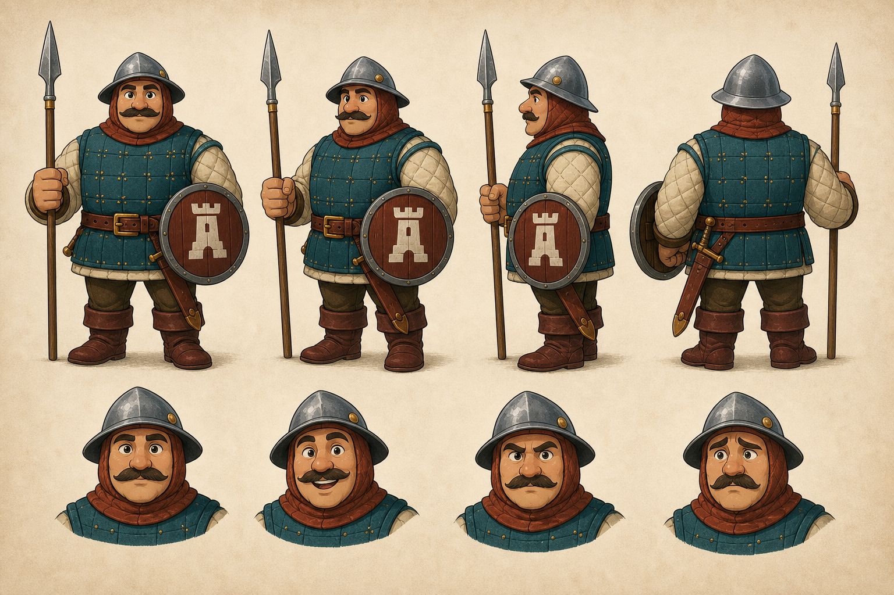

# AI image quality workflow

Workshop offers explicit ImageGen profiles instead of treating every generated image as the same operation:

| Profile | Quality | Size | Estimated image output cost |
| --- | --- | --- | ---: |
| Draft square | low | 1024 x 1024 | $0.006 |
| Final square | high | 1024 x 1024 | $0.211 |
| Final landscape | high | 1536 x 1024 | $0.165 |
| Final portrait | high | 1024 x 1536 | $0.165 |

The selector defaults to no generated image. Its profile is captured in the durable queue, included in the request fingerprint, reserved against the device spending limit, and reset after submission. The costs are conservative image-output estimates; normal model input and output usage remains separate.

Keep accepted ImageGen PNGs as lossless masters. If a v2 manifest opts a PNG into build preparation, Stasis downsizes it with Lanczos3 in linear-light, premultiplied-alpha space. The master remains unchanged.

## Vector reconstruction

SVG works best for deliberate silhouettes, icons, UI ornaments, flat-shaded props, and backgrounds built from clean layers. It is not a substitute for painterly texture. Use a high-quality ImageGen result as visual direction, then ask the coding model to reconstruct the important geometry instead of mechanically tracing every raster detail.

Use this brief with an attached reference:

```text
Reconstruct the attached reference as an original, compact SVG game asset.

Preserve the silhouette, proportions, major color relationships, recognizable
internal features, and visual weight at the intended in-game size.

Optimize for clean Bezier paths, balanced negative space, a small palette,
consistent stroke widths, and crisp rendering at 64, 128, 256, and 1024 pixels.
Use only paths, rectangles, circles, and simple linear or radial gradients.
Do not embed raster images, fonts, filters, masks, scripts, CSS, or external
resources. Remove details that disappear at the smallest intended size.
```

Render and inspect the result at its smallest gameplay size as well as a large review size. Correct silhouette, gaps, overlaps, stroke weight, and gradient behavior before accepting it.

## Reviewable demo

The demo below is a compact vector scene made from the same bounded primitives recommended for Stasis assets. Zoom it or open the source to review the paths and gradients; it remains resolution-independent.


## Consistency-first character demo

The [Hearthguard man-at-arms package](demos/man_at_arms/README.md) demonstrates the stronger production workflow: approve a raster model sheet, preserve it through reference-based pose and game-asset passes, then encode the accepted identity as palette/proportion tokens and named vector layers.



The canonical model, action, and asset-family sheets remain the quality anchors. The layered SVG is the reusable consistency mechanism; it should be iteratively art-directed toward those anchors rather than treated as a one-shot conversion.

For small tactical units, prefer a reference-anchored raster spritesheet over automatic vector reconstruction. The [man-at-arms 128 px sheet](demos/man_at_arms/man_at_arms_spritesheet_128.png) uses an exact 3 x 2 grid, fixed camera and scale, aggressive small-size simplification, chroma-key extraction, and named 128 x 128 cell exports. Its [sprite manifest](demos/man_at_arms/sprite_manifest.json) records the layout and content hashes.

The same transparent master also produces a [192 px sheet](demos/man_at_arms/man_at_arms_spritesheet_192.png) for a 4K presentation with approximately 15 gameplay cells across the non-UI portion of the screen. Those exports are reduced directly from 512 px source cells rather than enlarged from 128 px runtime sprites.
