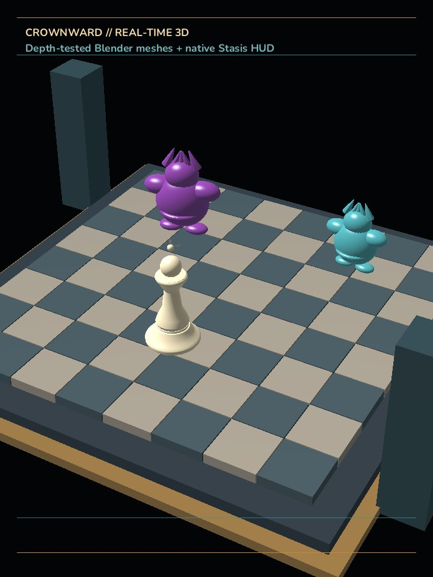

# Real-time 3D renderer exploration

This spike proves that a Stasis game can render real Blender meshes with a shared
perspective camera, depth testing, per-object materials, lighting, fog, and the
existing Stasis 2D HUD in one frame.



The capture is from `samples/realtime_3d` running through the Stasis JIT and the
desktop OpenGL backend. It is not a mockup or a Blender render.

## What changed

- The dormant desktop OpenGL path can now load triangle meshes from OBJ files,
  upload immutable vertex buffers, queue transformed mesh instances, and render
  them before the normal 2D command pass.
- A GLSL 1.20 material shader supplies directional and hemispheric light,
  roughness/metallic controls, rim light, emission, fog, and gamma correction.
- The JIT and AOT symbol resolvers expose mesh, camera, environment, and draw
  functions to Stasis code.
- The representative scene uses Blender-exported chess and creep geometry. Board
  squares are merged into two meshes rather than submitted as 64 separate meshes.

This exploration deliberately uses direct JIT-to-runtime calls to queue 3D draws.
That is useful for proving the renderer, but it is not the production hot-path
contract. Production 3D commands should be added to the versioned render-command
ABI and consumed once per frame, preserving Stasis's existing host ownership and
determinism.

The exported API is backward-compatible at load time. An SDL-only build links the
same symbols, reports that mesh loading is unavailable, and treats camera/draw
calls as no-ops. This keeps the canonical runtime and current mobile packages from
failing to load while 3D remains an opt-in desktop capability.

## Measured result

Measurements were taken at a 720x960 logical/drawable size on Intel Arc OpenGL
4.6. Each run included process startup, OBJ parsing, GPU upload, and 300 frames.

| Scene | Expanded vertices | Native draws/frame | Wall result |
| --- | ---: | ---: | ---: |
| Full Blender exports, per-square board | about 330k | about 75 | 41.4 FPS |
| LOD meshes, two batched board meshes | about 78k | 13 | 55.4 FPS |

At gameplay scale the LOD/batched version preserved the silhouette and scene
composition while recovering roughly 34% wall-frame throughput. The benchmark is
directional rather than a GPU-only result because startup work is included.

Stasis already distinguishes logical, native, and drawable dimensions. The 3D
pass renders to the drawable viewport, while the HUD uses logical coordinates and
high-density font atlases. That is the correct model for a 720x960 layout on a
1440x1920 or denser phone. SDL also documents that a high-DPI drawable may be
larger than its window coordinate size when `SDL_WINDOW_ALLOW_HIGHDPI` is used.

## Why this still trails the ThreeJS version

The test removed the perspective mismatch of composited sprites, but it does not
yet reproduce the visual systems ThreeJS supplied:

- OBJ carries no hierarchy, animation, PBR materials, or texture assignments.
- The shader has one simplified material model and no normal, ORM, or emissive
  maps.
- There are no directional shadows, contact shadows, environment reflections,
  tone mapping, bloom, temporal anti-aliasing, or color grading.
- Every mesh instance is a separate draw; there is no instancing, culling, or
  GPU-driven visibility.
- The procedural prototype creeps need a stronger authored silhouette and surface
  detail. Rendering them in 3D faithfully exposes those content limitations.

The important result is that prerendering is not required for spatial coherence.
The remaining difference is a bounded renderer-and-content roadmap, not a language
limitation.

## Renderer options

| Path | Advantage | Constraint | Verdict |
| --- | --- | --- | --- |
| Extend current OpenGL code | Fastest proof; smallest desktop diff | OpenGL 2.1-era shell, no canonical Android path, manual backend work | Keep only as the experiment |
| Add GLES 3 beside OpenGL | Direct route to Android | Duplicates platform/shader/resource work; Metal remains separate | Acceptable bridge, poor long-term center |
| Adopt `sokol_gfx` | Small C-facing API; GLES3, GL, D3D11, Metal, WebGPU backends; fits the C runtime | New resource and shader build layer | Best incremental production fit |
| Adopt `wgpu`/`wgpu-native` | Strong validation and first-class Vulkan, Metal, DX12, browser WebGPU | Larger runtime and build-system migration; GL is downlevel | Best choice if Stasis commits to a Rust-owned renderer |

Because Stasis currently owns platform graphics in a compact C runtime,
`sokol_gfx` is the recommended next implementation step. `wgpu` becomes the
better choice if renderer ownership moves to Rust and the team accepts the larger
migration. The spike should not grow into a custom multi-API renderer.

References:

- [sokol supported backends and platforms](https://github.com/floooh/sokol)
- [wgpu supported platforms and backends](https://github.com/gfx-rs/wgpu)
- [SDL high-DPI window/drawable behavior](https://wiki.libsdl.org/SDL2/SDL_CreateWindow)

## Competitive production slice

1. Define render-command v2 resources for scene, camera, light, mesh, material,
   animation, and instance batches. Keep the 2D HUD as the final pass.
2. Replace OBJ with GLB/glTF 2.0. glTF is designed for runtime delivery and carries
   scenes, hierarchy, PBR materials, textures, skins, and animation. Use KTX2 with
   Basis Universal for transcodable GPU-compressed textures on mobile.
3. Implement instancing, frustum culling, three LODs, and fixed mobile quality
   tiers before adding expensive effects.
4. Add the largest visual gains in order: one cascaded or focused directional
   shadow, contact shadows, HDR image-based lighting, ACES-style tone mapping,
   selective bloom, and a restrained color grade.
5. Validate identical 720x960 logical composition at 1x, 2x, and 3x drawable
   scales, then profile representative low/mid/high Android GPUs. The current
   Android native build forces the SDL-only renderer, so this desktop spike is not
   evidence that real-time 3D already ships on phones.

The release build exposed one adjacent packaging gap: desktop `stasis build`
produced the executable and runtime libraries but did not stage the sample's OBJ
or font files. Copying the assets beside the generated release artifact allowed
the AOT runner to render and capture the same 720x960 frame successfully. A real
GLB feature should integrate with the shared asset manifest/package pipeline, not
add another loose-file copier.

Format references:

- [Khronos glTF runtime asset delivery](https://www.khronos.org/gltf/)
- [Khronos KTX2 and Basis Universal](https://www.khronos.org/ktx/)

## Reproduction

Configure the desktop runtime with `STASIS_GRAPHICS_SDL_ONLY=OFF`, build
`stasis_graphics`, then run:

```powershell
cargo run -p stasis -- check --workspace samples/realtime_3d
cargo run -p stasis -- play samples/realtime_3d/main.stasis --ticks 300 --screenshot target/realtime-3d/frame.png --screenshot-frame 300 --exit-after-screenshot
cargo run -p stasis -- build --workspace samples/realtime_3d --out target/realtime-3d/aot
```

The OpenGL runtime DLL must be discoverable by the Stasis executable. The normal
app build copies a runtime candidate next to the executable.

Theory gained: Stasis's logical/drawable display split and two-pass renderer are
already sufficient to compose resolution-independent UI over true 3D; the missing
invariant is a cross-platform GPU resource/command ABI, and once that exists the
same scene description should map naturally to desktop and mobile backends.
